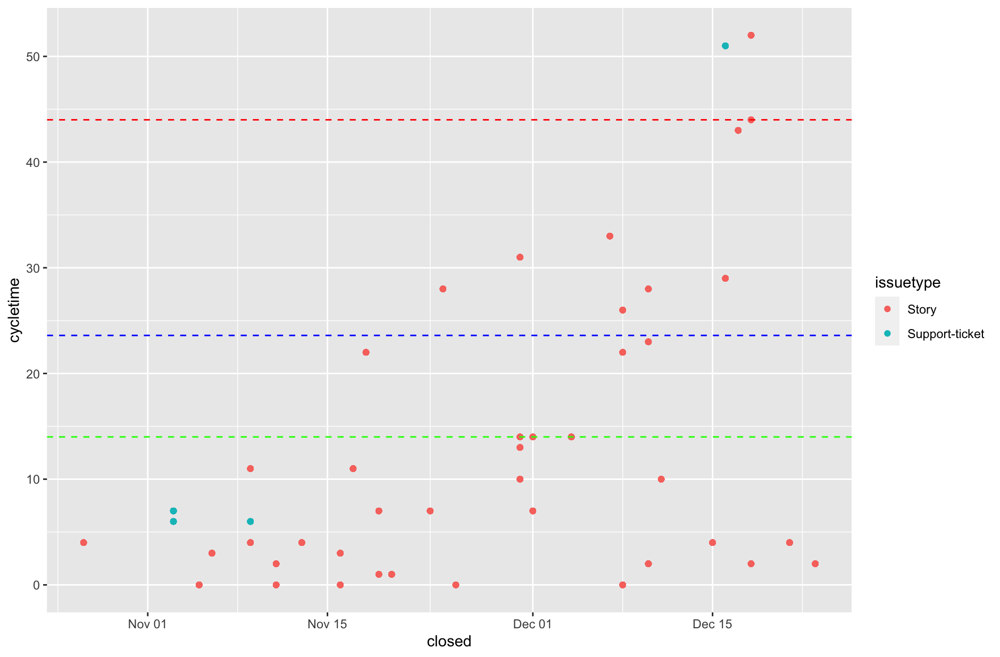
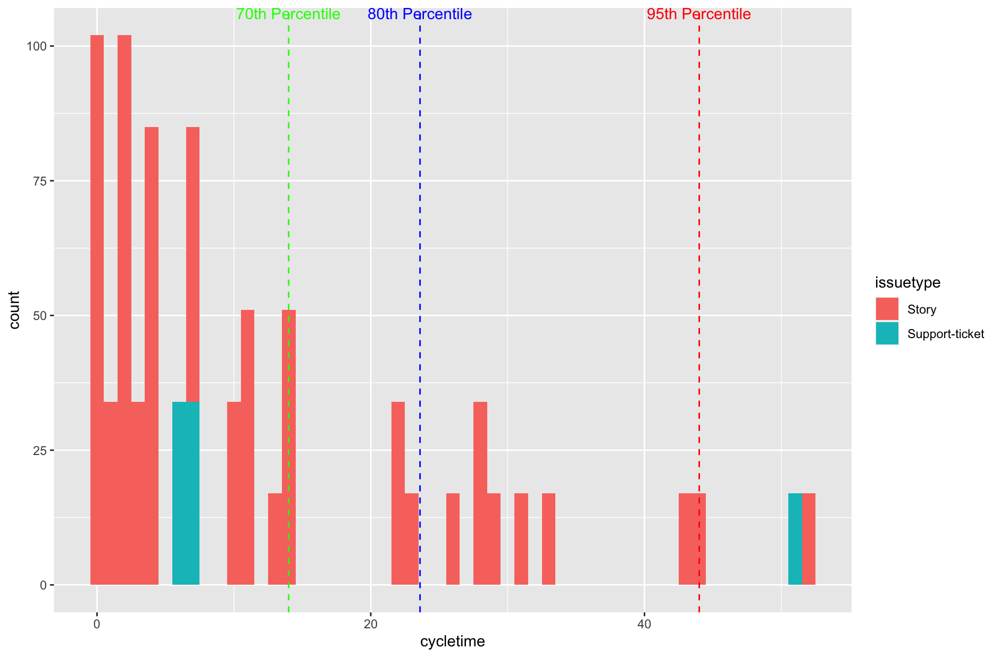
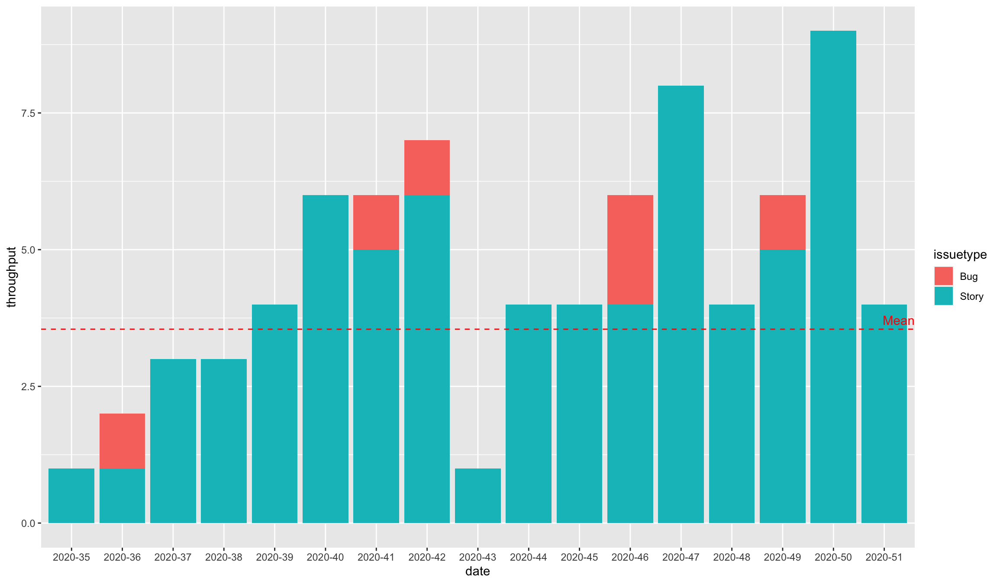

# R Jira Stats

Simple R scripts to generate some insigths on Jira boards.

## How to use the scripts

1 - Open the project JiraStats.Rproj in your RStudio.

2 - Install all the dependencies running the following code in your RStudio Console.

```{R}
install.packages(dplyr)
install.packages(ggplot2)
install.packages(tidyr)
install.packages(tidyverse)
install.packages(lubridate)
install.packages(httr)
install.packages(jsonlite)
```

3 - Create a file called config.yml in the project root folder that looks like to this one: 

```{yml}
default:
  token: <<Token to access Jira>>
  base_url: https://<<your jira instance address>>.atlassian.net/rest/api/2/
```
4 - Add your Jira API token to the file and also change your base_url.
[Getting Jira API token](https://confluence.atlassian.com/cloud/api-tokens-938839638.html)

5 - Change the variable filter at the beginning of each script using [JQL language](https://www.atlassian.com/software/jira/guides/expand-jira/jql) and run the scripts in RStudio.

## Examples of outputs of each script:





## To do
- [ ] Refactor the scripts to not duplicate code.
