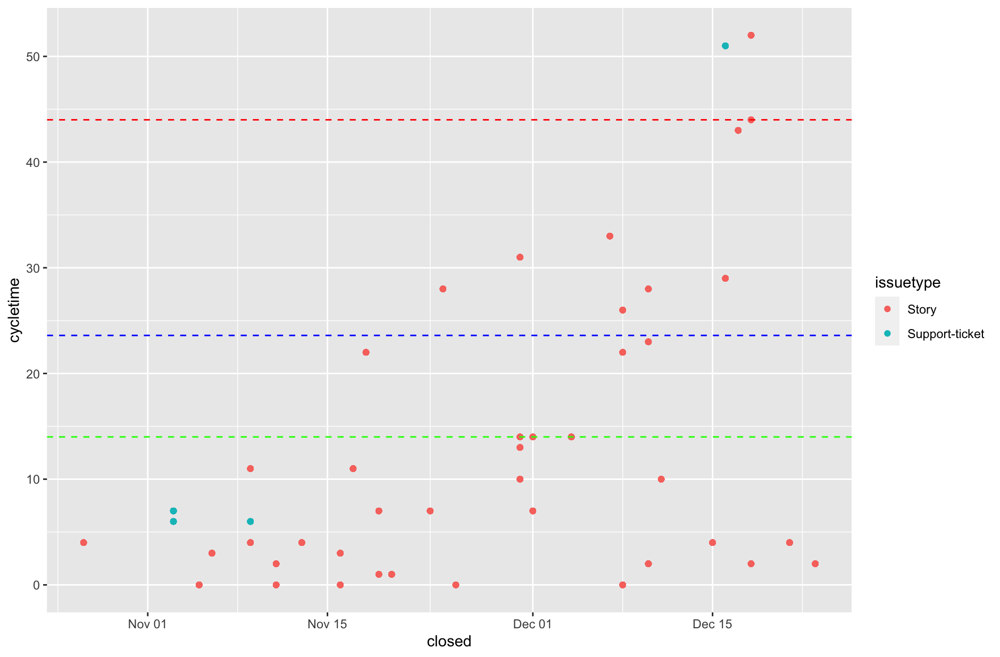
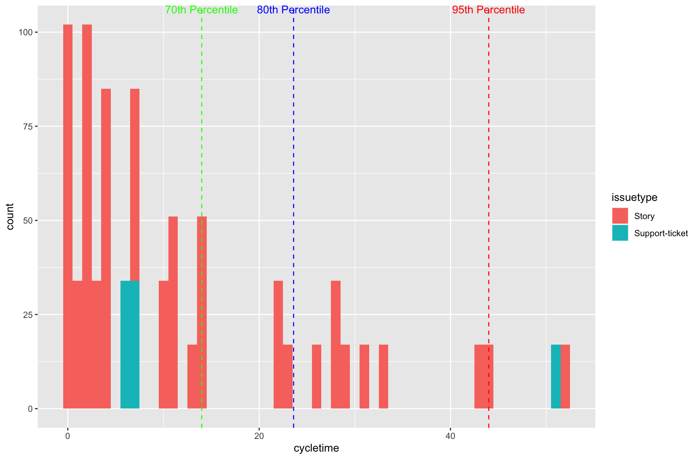

# R Jira Stats

Simple scripts to generate some insigths on Jira boards

## how to use

1 - Create a file called config.yml that looks like to this one: 

```{yml}
default:
  token: <<Token to access Jira>>
  base_url: https://<<your jira instance address>>.atlassian.net/rest/api/2/

```

[Getting Jira API token](https://confluence.atlassian.com/cloud/api-tokens-938839638.html)

2 - Run the scripts in RStudio.





## To do
- [ ] Refactor the scripts to not duplicate code.
